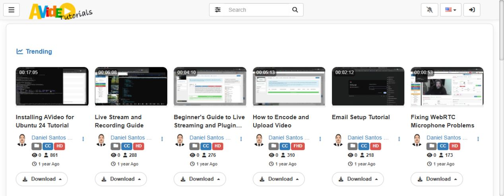
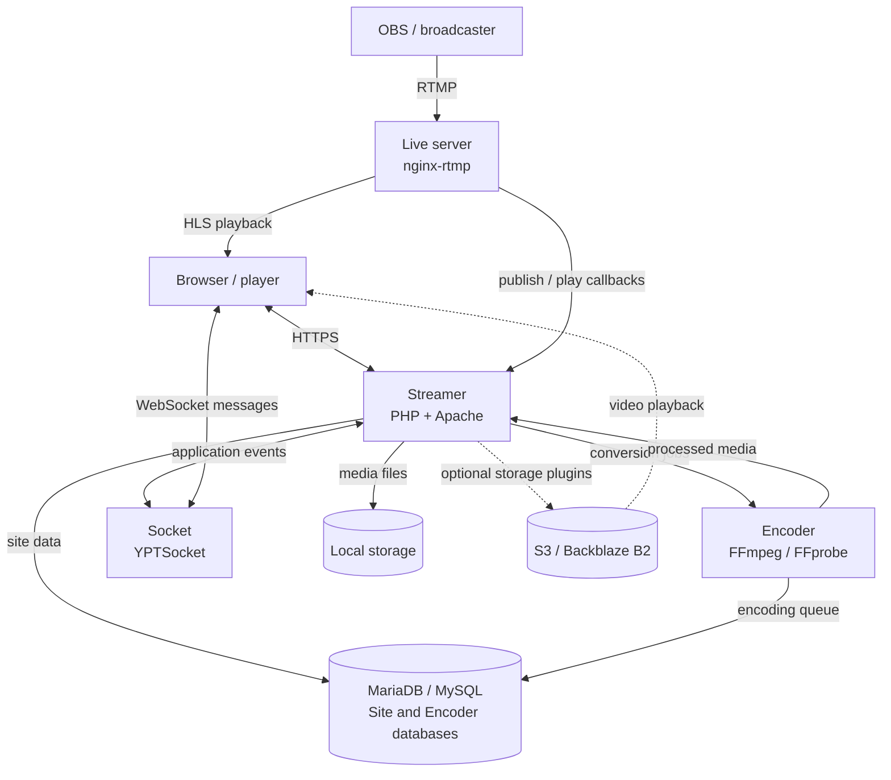

# First thing...

I thank God for graciously, through His mercy, giving me all the necessary knowledge acquired throughout my life and throughout the development of this project. It is only through His grace and provision that this was possible, and I am truly grateful for His presence every step of the way.

> **For of Him, and through Him, and to Him, are all things: to whom be glory forever. Amen.**
> `Apostle Paul in Romans 11:36`

<p align="center">
  
</p>

<p align="center">
 
  <a href="https://github.com/WWBN/AVideo/actions/workflows/tests.yml">
    
  </a>
  <a href="https://github.com/WWBN/AVideo/stargazers">
    
  </a>
  <a href="https://github.com/WWBN/AVideo/network/members">
    
  </a>
  <br/>
  <a href="https://github.com/WWBN/AVideo/commits/master">
    
  </a>
  <a href="https://github.com/WWBN/AVideo/graphs/contributors">
    
  </a>
  <a href="https://github.com/WWBN/AVideo">
    
  </a>
</p>

### [!IMPORTANT] Domain Update Notice

Our previous domains — **youphptube.com** and **youphp.tube** — are being retired following a dispute initiated by **Google LLC (YouTube)**.  
Although we firmly believe that **YouPHPTube** has always been an **independent, open-source project**, created to empower developers and organizations to host their own video platforms, we have decided to **respect the process and move forward peacefully**.  

🆕 **Please update your bookmarks and references to the new official domain:**  

👉 [https://streamphp.com/](https://streamphp.com/)  

Thank you for your continued support and for standing with open-source freedom.


# AVideo

AVideo is a self-hosted video platform for publishing, managing, and monetizing on-demand videos and live broadcasts on your own infrastructure.

**[Try the live demo](https://demo.avideo.com/)** · [Quickstart](#quickstart-docker-compose) · [Installation](#installation) · [Wiki](https://github.com/WWBN/AVideo/wiki) · [Website](https://streamphp.com/) · [Releases](https://github.com/WWBN/AVideo/releases)

<p align="center">
  <a href="https://tutorials.avideo.com/">
    
  </a>
</p>

<p align="center"><em>The video gallery on <a href="https://tutorials.avideo.com/">AVideo Tutorials</a>, a running AVideo installation.</em></p>

## Quickstart (Docker Compose)

The included Compose stack runs the Streamer, Encoder, live server, databases, and cache. You need a Linux server with Docker and the Docker Compose plugin.

```bash
git clone https://github.com/WWBN/AVideo.git
cd AVideo
cp -n env.example .env
```

Edit `.env` before the first start:

- Set `SERVER_NAME` to your domain, without `https://` or a path.
- Set `CONTACT_EMAIL` and `WEBSITE_TITLE`.
- Set strong, unique values for `SYSTEM_ADMIN_PASSWORD` and `DB_MYSQL_PASSWORD`.
- Adjust `CPUS_LIMIT` and `MEMORY_LIMIT` to your server's capacity.

Your domain must point to the server, with ports **80** and **443** open for HTTPS certificate setup. Then start the stack:

```bash
docker compose up -d --build
docker compose ps
docker compose logs -f avideo
```

Wait for the initial installation to finish, open `https://your-domain.com/`, and sign in as `admin` with your `SYSTEM_ADMIN_PASSWORD`. Press `Ctrl+C` to stop watching the logs; the containers keep running.

See the [Docker guide](https://github.com/WWBN/AVideo/wiki/Running-AVideo-with-Docker) for certificates, persistent data, backups, updates, and troubleshooting.

## Architecture

The Streamer handles the website and application data; the Encoder processes uploads; the live server handles broadcast ingest and delivery. Socket carries real-time application messages.



This diagram shows logical components. In the [included Compose stack](docker-compose.yml), Streamer, Encoder, and Socket run inside the `avideo` container; `live`, `database`, `database_encoder`, and `memcached` run as separate services. S3/B2 is optional and requires a provider account and the corresponding storage plugin.

| Component | Purpose | When you need it |
| --- | --- | --- |
| **Streamer** — this repository | The website, player, video library, user accounts, and administration. | Every AVideo installation. |
| **[Encoder](https://github.com/WWBN/AVideo-Encoder)** | Converts uploaded video and audio into formats suitable for browser playback. | When uploads need conversion. It can run on the same server or a separate server. |
| **[Live server](https://github.com/WWBN/AVideo/wiki/Live-Plugin)** | Receives live broadcasts and delivers them to viewers, typically using NGINX with RTMP and HLS. | When you want live streaming. |
| **[Socket](https://github.com/WWBN/AVideo/wiki/Socket-Plugin)** | Delivers real-time application messages through YPTSocket. | Features that use real-time updates; it runs as a long-lived PHP process. |
| **MariaDB / MySQL** | Stores users, video metadata, settings, and the Encoder queue in their respective databases. | Every Streamer installation; the Encoder also has its own database. |
| **[Storage](https://github.com/WWBN/AVideo/wiki/Storage-Options)** | Stores media on local disk or through providers such as S3 and Backblaze B2. | Local disk by default; remote storage depends on your deployment and plugins. |

The Streamer can also accept files already prepared for browser playback or embed videos hosted elsewhere. Those workflows do not require encoding every upload. See [upload options](https://github.com/WWBN/AVideo/wiki/About-Video-Upload).

## Technical decisions

| Choice | What it enables | Operational trade-off |
| --- | --- | --- |
| **PHP + Apache for the Streamer** | Deployment on a LAMP stack, using the supplied `.htaccess` routing rules. | The server must provide compatible PHP extensions and Apache configuration. |
| **A separate Encoder component** | Video conversion can run on a different server, keeping encoding CPU load away from the website. | The Encoder and Streamer must communicate and transfer the processed media. |
| **nginx-rtmp + HLS for live video** | Broadcasters publish with RTMP; viewers play HLS in the browser. | A live server, its callbacks, and sufficient bandwidth must be configured. |
| **WebSocket messages through YPTSocket** | Real-time application events can reach browsers independently of video delivery. | Requires a running Socket process and a browser-accessible WebSocket endpoint. |
| **Relational data separate from media files** | MySQL/MariaDB stores application data while local disk or storage plugins hold the media. | Backups must cover both the databases and media; cloud providers add configuration and usage costs. |
| **Plugins for optional features** | Add monetization, storage, and integrations to suit each installation. | Feature availability depends on installed plugins; some are distributed separately and require purchase. |

## Installation

For Docker, use the [quickstart](#quickstart-docker-compose) and [Docker installation guide](https://github.com/WWBN/AVideo/wiki/Running-AVideo-with-Docker). For an installation directly on a server, follow the Ubuntu steps below.

### Ubuntu server

Use a fresh Ubuntu Server with `sudo` access and no hosting control panel such as cPanel, Plesk, or Webmin. The installation guide assumes direct control of Apache, PHP, the database, and system packages.

1. Point your domain to the server and open ports **80** and **443**.
2. Follow the [Ubuntu installation guide](https://github.com/WWBN/AVideo/wiki/How-to-install-LAMP,-FFMPEG-and-Git-on-a-fresh-Ubuntu-24.x-for-AVideo-Platform) to install the dependencies, download AVideo, and configure HTTPS.
3. Open `https://your-domain.com/install/`. Resolve any failed required checks, enter the database and site settings, and choose your administrator password. See the [installation setup page](https://github.com/WWBN/AVideo/wiki/Installation-Setup-Page) for each field.
4. Sign in as `admin` with the password you chose.
5. Add a [private Encoder](https://github.com/WWBN/AVideo/wiki/Private-Encoder) if you need video conversion. Configure a [live server](https://github.com/WWBN/AVideo/wiki/How-to-make-a-live-stream) if you need live broadcasts.

### Publish your first video

After either installation:

1. Open the **Admin Panel**, set the site name and logo, and configure email.
2. Run **Health Check** and follow the [Quick Start Guide](https://github.com/WWBN/AVideo/wiki/Quick-Start-Guide) to finish configuration and scheduled tasks.
3. Upload a short test video. If using the Encoder, wait for conversion and transfer to finish.
4. Confirm playback in a private browser window and on a phone before inviting users.

## Server requirements

| Requirement | Details |
| --- | --- |
| **PHP** | **8.1 or later**, as required by [Composer](composer.json) and the installer. Use a maintained PHP release compatible with your installation. |
| **PHP extensions** | `mysqli`, `curl`, `gd`, `mbstring`, `zip`, `zlib`, and `openssl` are checked by the installer. Additional features may need other extensions. |
| **Database** | MySQL or MariaDB. Follow the installation guide for the database setup. |
| **Web server** | Apache 2.x with `mod_rewrite` and support for the supplied `.htaccess` rules. |
| **Application dependencies** | The supplied `vendor/` and `node_modules/` assets. The installer checks for missing dependencies. |
| **Media tools** | FFmpeg, FFprobe, and ExifTool for media processing; requirements vary by component and feature. |
| **Capacity** | Disk space for media and processing, CPU for encoding, and bandwidth for viewers. |

For sizing and deployment planning, see [hardware and server requirements](https://github.com/WWBN/AVideo/wiki/AVideo-Platform-Hardware-Requirements).

## Features and plugins

- **Video library:** uploads, channels, categories, playlists, search, comments, and user management.
- **Live broadcasts:** [live streaming](https://github.com/WWBN/AVideo/wiki/Live-Plugin), recording, restreaming, and [chat](https://github.com/WWBN/AVideo/wiki/Chat2-Plugin).
- **HLS and offline viewing:** [VideoHLS](https://github.com/WWBN/AVideo/wiki/VideoHLS-Plugin) for adaptive playback and encryption, and [VideoOffline](https://github.com/WWBN/AVideo/wiki/VideoOffline-Plugin) for offline viewing.
- **Monetization:** [subscriptions](https://github.com/WWBN/AVideo/wiki/Subscription-Plugin), [pay-per-view](https://github.com/WWBN/AVideo/wiki/PayPerView-Plugin), [video ads](https://github.com/WWBN/AVideo/wiki/AD_Server-Plugin), and [VAST/VMAP integration](https://github.com/WWBN/AVideo/wiki/GoogleAds_IMA---Videos-Ads-on-your-page).
- **Storage and delivery:** local storage, external storage providers, and CDN options. See [storage options](https://github.com/WWBN/AVideo/wiki/Storage-Options).
- **Integrations:** the [AVideo API](https://github.com/WWBN/AVideo/wiki/AVideo-Platform-API) for external applications and custom development.

Availability depends on the plugins installed and enabled. Some plugins are distributed separately and require purchase; review their documentation and the [marketplace](https://streamphp.com/marketplace/) before planning your deployment.

## Demos

- [Platform demo](https://demo.avideo.com/) — explore the main interface.
- [Flix demo](https://flix.avideo.com/) — explore an alternative layout.
- [Tutorials](https://tutorials.avideo.com/) — videos about setup and features.

## Documentation and support

| Resource | Use it for |
| --- | --- |
| [Wiki](https://github.com/WWBN/AVideo/wiki) | Installation, configuration, and plugin documentation. |
| [Admin Manual](https://github.com/WWBN/AVideo/wiki/Admin-Manual) | Managing users, videos, settings, and plugins. |
| [Updates](https://github.com/WWBN/AVideo/wiki/How-to-Update-your-AVideo-Platform) and [releases](https://github.com/WWBN/AVideo/releases) | Keeping an existing installation current. |
| [Backups](https://github.com/WWBN/AVideo/wiki/How-to-make-a-backup) | Saving and restoring site data. |
| [Troubleshooting](https://github.com/WWBN/AVideo/wiki/How-to-find-errors-on-AVideo-Platform) | Finding logs and diagnosing errors. |
| [GitHub Issues](https://github.com/WWBN/AVideo/issues) | Reporting bugs with reproduction steps, versions, and relevant logs. Remove passwords and other secrets before posting. |
| [Professional support](https://streamphp.com/marketplace/) | Paid installation, plugins, and consulting from Daniel Neto. |

## License and intended use

See [LICENSE](LICENSE) for the software license, including its requirement that the software be used for Good, not Evil.

The project's installation agreement prohibits using this software to create sexually explicit material, pornography, or adult-themed content.
