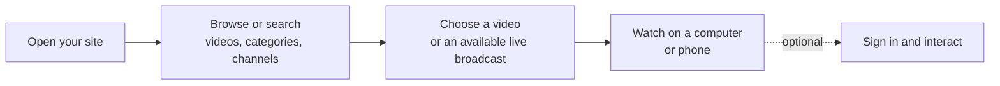
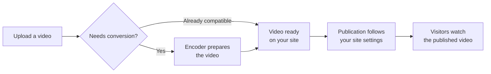
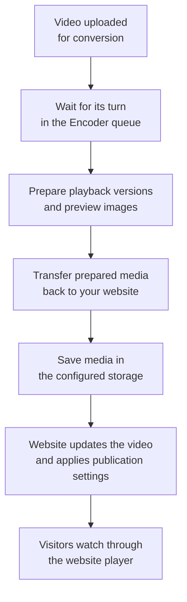
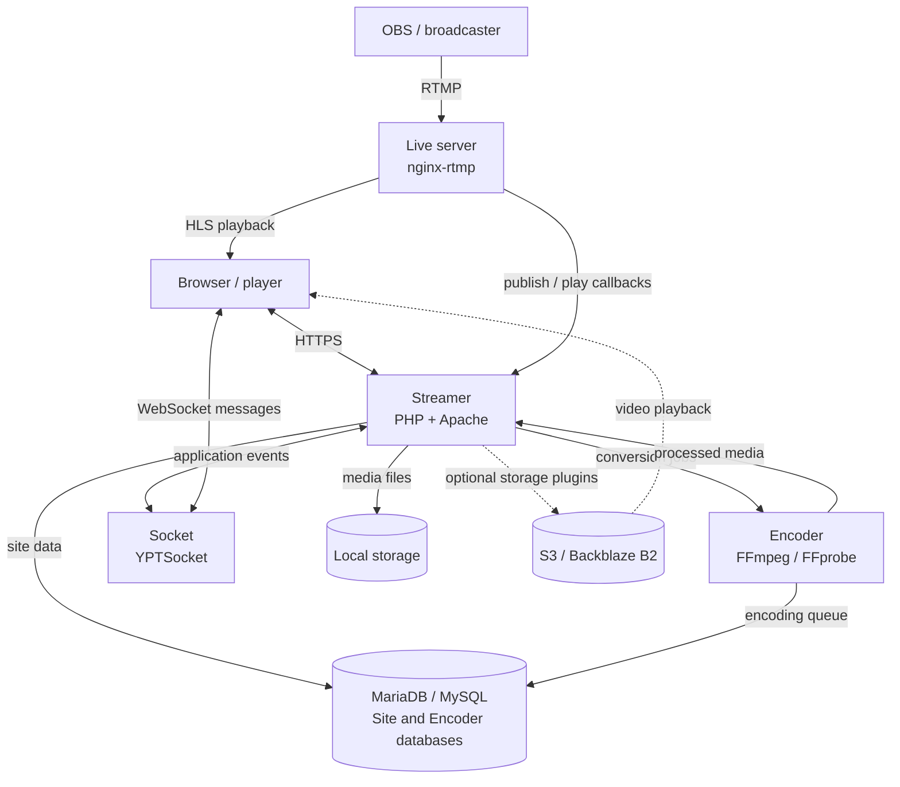

# First thing...

I thank God for graciously, through His mercy, giving me all the necessary knowledge acquired throughout my life and throughout the development of this project. It is only through His grace and provision that this was possible, and I am truly grateful for His presence every step of the way.

> **For of Him, and through Him, and to Him, are all things: to whom be glory forever. Amen.**
> `Apostle Paul in Romans 11:36`

<p align="center">
  
</p>

<p align="center">
 
  <a href="https://github.com/WWBN/AVideo/actions/workflows/tests.yml">
    
  </a>
  <a href="https://github.com/WWBN/AVideo/stargazers">
    
  </a>
  <a href="https://github.com/WWBN/AVideo/network/members">
    
  </a>
  <br/>
  <a href="https://github.com/WWBN/AVideo/commits/master">
    
  </a>
  <a href="https://github.com/WWBN/AVideo/graphs/contributors">
    
  </a>
  <a href="https://github.com/WWBN/AVideo">
    
  </a>
</p>

### [!IMPORTANT] Domain Update Notice

Our previous domains — **youphptube.com** and **youphp.tube** — are being retired following a dispute initiated by **Google LLC (YouTube)**.  
Although we firmly believe that **YouPHPTube** has always been an **independent, open-source project**, created to empower developers and organizations to host their own video platforms, we have decided to **respect the process and move forward peacefully**.  

🆕 **Please update your bookmarks and references to the new official domain:**  

👉 [https://streamphp.com/](https://streamphp.com/)  

Thank you for your continued support and for standing with open-source freedom.


# AVideo

AVideo is a self-hosted video platform for publishing, managing, and monetizing on-demand videos and live broadcasts on your own infrastructure.

**[Try the live demo](https://demo.avideo.com/)** · [Use cases](#use-cases) · [White label and layouts](#white-label-and-layouts) · [Monetization](#monetization) · [Content tools](#content-tools-and-platform-growth) · [Quickstart](#quickstart-docker-compose) · [Installation](#installation) · [How it works](#how-your-site-works) · [Wiki](https://github.com/WWBN/AVideo/wiki) · [Website](https://streamphp.com/) · [Releases](https://github.com/WWBN/AVideo/releases)

<p align="center">
  <a href="https://tutorials.avideo.com/">
    
  </a>
</p>

<p align="center"><em>The video gallery on <a href="https://tutorials.avideo.com/">AVideo Tutorials</a>, a running AVideo installation.</em></p>

## Use cases

| Use case | How you can use AVideo |
| --- | --- |
| **Community video portal** | Let creators publish videos and organize discovery around [Gallery sections](https://github.com/WWBN/AVideo/wiki/Gallery-Plugin) and [channels](https://github.com/WWBN/AVideo/wiki/FirstPageChannelList-Plugin). |
| **Education and staff training** | Publish recorded lessons and tutorials, with [user groups](https://github.com/WWBN/AVideo/wiki/Create-non-public-videos-and-deal-with-user-groups) controlling access for students, teams, or members. |
| **Premium video catalog** | Present films, series, or lessons in a [Flix layout](https://github.com/WWBN/AVideo/wiki/Configure-a-Netflix-Clone-Page), and sell [memberships](https://github.com/WWBN/AVideo/wiki/Subscription-Plugin) or [individual video access](https://github.com/WWBN/AVideo/wiki/PayPerView-Plugin). |
| **Live events** | [Broadcast](https://github.com/WWBN/AVideo/wiki/How-to-make-a-live-stream) conferences, concerts, or sports, with optional [paid event tickets](https://github.com/WWBN/AVideo/wiki/PayPerView-Live-Plugin). |
| **Churches and nonprofit communities** | Share recorded talks and [live broadcasts](https://github.com/WWBN/AVideo/wiki/Live-Plugin), with optional [donation links or wallet donations](https://github.com/WWBN/AVideo/wiki/How-To-Make-Money-on-AVideo-Platform#6-accept-donations) to support creators. |

## White label and layouts

AVideo can run as a video website under your own brand. Start with [Site Design and Templates](https://github.com/WWBN/AVideo/wiki/Site-Design-and-Templates):

- **Your identity:** use your own domain, site title, logo, and favicon. Configure these through the site settings; see the [Quick Start Guide](https://github.com/WWBN/AVideo/wiki/Quick-Start-Guide).
- **White-label branding:** the paid [Customize plugin](https://github.com/WWBN/AVideo/wiki/Customize-Plugin) lets you replace the **Powered by AVideo** footer, customize the About page and site colors, and replace default placeholder images.
- **Custom design:** add your own [CSS or JavaScript](https://github.com/WWBN/AVideo/wiki/Add-Custom-CSS-or-JavaScript), or build a [separate frontend](https://github.com/WWBN/AVideo/wiki/Build-Your-Own-Frontend) connected to the AVideo API.

Choose a presentation that fits your content:

| Layout | Presentation | Guide |
| --- | --- | --- |
| **Gallery** | A video portal with sections for categories, trending videos, playlists, and channels. | [Gallery plugin](https://github.com/WWBN/AVideo/wiki/Gallery-Plugin) |
| **Flix** | A movie or series catalog with featured artwork and horizontal content rows. | [Configure the Flix layout](https://github.com/WWBN/AVideo/wiki/Configure-a-Netflix-Clone-Page) |
| **Channels** | Put creators and their channels at the center of browsing. | [FirstPageChannelList plugin](https://github.com/WWBN/AVideo/wiki/FirstPageChannelList-Plugin) |
| **Player first page** | Open directly to a video player and related content. | [Homepage Layout Options](https://github.com/WWBN/AVideo/wiki/Homepage-Layout-Options) |
| **React frontend** | Develop your own viewer interface as a separate application using the API and embed player. | [Build Your Own Frontend](https://github.com/WWBN/AVideo/wiki/Build-Your-Own-Frontend) |

The built-in homepage layouts are free and selected in **Admin Panel → Design → First Page Style**. The React frontend is deployed separately. See [layout options](https://github.com/WWBN/AVideo/wiki/Homepage-Layout-Options) for the differences.

You can also choose [light and dark themes](https://github.com/WWBN/AVideo/wiki/Dark-&-Light-Themes), change the [player appearance](https://github.com/WWBN/AVideo/wiki/Player-and-PlayerSkins-Plugin), and adjust menus, buttons, and extra HTML with the free [CustomizeAdvanced plugin](https://github.com/WWBN/AVideo/wiki/Advanced-Customization-Plugin).

## Monetization

You can combine several revenue models on the same site. See the [monetization overview](https://github.com/WWBN/AVideo/wiki/How-To-Make-Money-on-AVideo-Platform) for setup and payment flows.

| Model | How it works | Guide |
| --- | --- | --- |
| **Subscriptions** | Sell membership plans that unlock a premium video library for the subscription period. | [Subscription](https://github.com/WWBN/AVideo/wiki/Subscription-Plugin) |
| **Pay-per-view** | Charge for time-limited access to individual videos or tickets to live events. | [Video PPV](https://github.com/WWBN/AVideo/wiki/PayPerView-Plugin) · [Live PPV](https://github.com/WWBN/AVideo/wiki/PayPerView-Live-Plugin) |
| **Advertising** | Show banner, overlay, or video ads; run your own campaigns or connect a VAST/VMAP ad provider. | [Advertising options](https://github.com/WWBN/AVideo/wiki/AVideo-Platform-Advertising) |
| **Fan memberships** | Creators sell access to their own fans-only videos and broadcasts, with an optional share for the site owner. | [FansSubscriptions](https://github.com/WWBN/AVideo/wiki/FansSubscriptions-Plugin) |
| **Creator donations** | Let viewers support creators through external donation links or transfers from their site wallet. | [Donation options](https://github.com/WWBN/AVideo/wiki/How-To-Make-Money-on-AVideo-Platform#6-accept-donations) |

Subscription, PayPerView, PayPerView Live, and FansSubscriptions are paid add-ons. Advertising includes free plugins and the paid GoogleAds IMA integration; see each guide for requirements.

Wallet-based purchases require [YPTWallet](https://github.com/WWBN/AVideo/wiki/YPTWallet-Usage) and a configured payment gateway, such as [PayPal](https://github.com/WWBN/AVideo/wiki/PayPalYPT-Plugin) or [Stripe](https://github.com/WWBN/AVideo/wiki/StripeYPT-Plugin). Payment-provider fees and infrastructure costs apply; configure prices and creator shares for your business model.

For sites with multiple creators, see [creator payment options](https://github.com/WWBN/AVideo/wiki/Options-for-Paying-Content-Producers) for sales commissions, wallet withdrawals, and direct creator payments through the supported Stripe PPV configuration.

## Content tools and platform growth

- **AI publishing tools:** request transcriptions, translations, dubbing, metadata suggestions, and suggested short clips. The included AI plugin uses a service paid with Marketplace credits; transcription and dubbing also require paid plugins. See [AI tools and requirements](https://github.com/WWBN/AVideo/wiki/AI-Plugin).
- **More content formats:** publish video and audio, plus PDFs and images through the enabled upload options. Combine recorded lessons or talks with supporting materials. See [content types and upload methods](https://github.com/WWBN/AVideo/wiki/About-Video-Upload).
- **Embeds and integrations:** place the [AVideo player on another website](https://github.com/WWBN/AVideo/wiki/Video-Embed-URL-for-AVideo), connect applications through the [API](https://github.com/WWBN/AVideo/wiki/AVideo-Platform-API), or automate [uploads from external applications](https://github.com/WWBN/AVideo/wiki/Upload-videos-from-third-party-applications).
- **Grow your infrastructure:** run a [private Encoder](https://github.com/WWBN/AVideo/wiki/Private-Encoder) on a separate server, choose [remote storage](https://github.com/WWBN/AVideo/wiki/Storage-Options), and add [CDN delivery](https://github.com/WWBN/AVideo/wiki/CDN-Plugin) to reduce origin traffic as your audience grows. Storage plugins, provider accounts, and CDN services can add costs; see [capacity planning](https://github.com/WWBN/AVideo/wiki/AVideo-Platform-Hardware-Requirements).

## What do I need to install?

Start with the website and the features you want to offer:

| What you want to do | What you need | What it does for you |
| --- | --- | --- |
| **Run your video website** | Streamer — this repository — with its database and media storage. | Provides the home page, video pages, search, channels, user accounts, and administration. |
| **Upload videos that need conversion** | [Encoder](https://github.com/WWBN/AVideo/wiki/Private-Encoder). | Prepares video files for browser playback. It can run on the same server as your site. |
| **Broadcast live** | [Live server](https://github.com/WWBN/AVideo/wiki/How-to-make-a-live-stream). | Receives your broadcast and delivers it to visitors watching on your site. |
| **Use remote media storage** | An optional [storage plugin and provider](https://github.com/WWBN/AVideo/wiki/Storage-Options), such as S3 or B2. | Keeps media on a storage provider; local disk is the default starting option. |

The Docker Compose option below installs the bundled components together. You can begin with recorded videos and configure live broadcasting or remote storage as you need them.

## Quickstart (Docker Compose)

The included Compose stack runs the Streamer, Encoder, live server, databases, and cache. You need a Linux server with Docker and the Docker Compose plugin.

```bash
git clone https://github.com/WWBN/AVideo.git
cd AVideo
cp -n env.example .env
```

Edit `.env` before the first start:

- Set `SERVER_NAME` to your domain, without `https://` or a path.
- Set `CONTACT_EMAIL` and `WEBSITE_TITLE`.
- Set strong, unique values for `SYSTEM_ADMIN_PASSWORD` and `DB_MYSQL_PASSWORD`.
- Adjust `CPUS_LIMIT` and `MEMORY_LIMIT` to your server's capacity.

Your domain must point to the server, with ports **80** and **443** open for HTTPS certificate setup. Then start the stack:

```bash
docker compose up -d --build
docker compose ps
docker compose logs -f avideo
```

Wait for the initial installation to finish, open `https://your-domain.com/`, and sign in as `admin` with your `SYSTEM_ADMIN_PASSWORD`. Press `Ctrl+C` to stop watching the logs; the containers keep running.

See the [Docker guide](https://github.com/WWBN/AVideo/wiki/Running-AVideo-with-Docker) for certificates, persistent data, backups, updates, and troubleshooting.

## How your site works

Each diagram answers a different question:

| Diagram | What it explains |
| --- | --- |
| [1. Visitor navigation](#diagram-1-visitor-navigation) | How visitors find and watch content on your site. |
| [2. Video publication](#diagram-2-video-publication) | How an upload becomes a published video, with or without conversion. |
| [3. Video processing](#diagram-3-video-processing-in-the-encoder) | What happens while the Encoder prepares an uploaded video. |
| [4. System components](#diagram-4-system-components) | How the website, Encoder, live server, database, and storage connect. Optional technical detail. |

### Diagram 1: Visitor navigation

**Purpose:** Shows the steps a visitor takes to find and watch a video or live broadcast. Your theme, settings, and enabled plugins determine the exact layout and available features.



When enabled and permitted by your settings, signed-in visitors can comment and use playlists.

### Diagram 2: Video publication

**Purpose:** Shows the overall path from uploading a file to making the video available on your site. The Encoder prepares files that need conversion; already compatible files can use direct upload.



Choose the title, category, and publication options for your content, and allow processing to finish before checking playback. Embedded videos remain hosted by their external provider. See [upload options](https://github.com/WWBN/AVideo/wiki/About-Video-Upload) for the available methods.

### Diagram 3: Video processing in the Encoder

**Purpose:** Shows what happens behind the scenes when you choose an upload method that uses the Encoder. The Encoder is the service that prepares video files for playback on your website.



Preparation can produce different video qualities and cover or preview images. The exact formats, qualities, and images depend on your Encoder settings and enabled features. Media can stay on the server or use a supported remote storage plugin.

After the file upload finishes, the video can still be waiting in the queue or undergoing conversion and transfer. Wait for the job to finish, then check playback on your site. Direct uploads of already compatible files and external embeds follow their own paths; they skip this conversion workflow. See [upload methods](https://github.com/WWBN/AVideo/wiki/About-Video-Upload) for the differences.

For live broadcasts, you send a live feed to the live server, and visitors open the broadcast on your website. Follow the [live setup guide](https://github.com/WWBN/AVideo/wiki/How-to-make-a-live-stream) when you are ready to add this feature.

<details>
<summary>Technical architecture and decisions (for server administrators)</summary>

### Diagram 4: System components

**Purpose:** Shows how the installed services connect, including recorded video and live broadcasting. This is a component overview for server administrators.

The Streamer handles the website and application data; the Encoder processes uploads; the live server handles broadcast ingest and delivery. Socket carries real-time application messages.



This diagram shows logical components. In the [included Compose stack](docker-compose.yml), Streamer, Encoder, and Socket run inside the `avideo` container; `live`, `database`, `database_encoder`, and `memcached` run as separate services. S3/B2 is optional and requires a provider account and the corresponding storage plugin.

| Component | Purpose | When you need it |
| --- | --- | --- |
| **Streamer** — this repository | The website, player, video library, user accounts, and administration. | Every AVideo installation. |
| **[Encoder](https://github.com/WWBN/AVideo-Encoder)** | Converts uploaded video and audio into formats suitable for browser playback. | When uploads need conversion. It can run on the same server or a separate server. |
| **[Live server](https://github.com/WWBN/AVideo/wiki/Live-Plugin)** | Receives live broadcasts and delivers them to viewers, typically using NGINX with RTMP and HLS. | When you want live streaming. |
| **[Socket](https://github.com/WWBN/AVideo/wiki/Socket-Plugin)** | Delivers real-time application messages through YPTSocket. | Features that use real-time updates; it runs as a long-lived PHP process. |
| **MariaDB / MySQL** | Stores users, video metadata, settings, and the Encoder queue in their respective databases. | Every Streamer installation; the Encoder also has its own database. |
| **[Storage](https://github.com/WWBN/AVideo/wiki/Storage-Options)** | Stores media on local disk or through providers such as S3 and Backblaze B2. | Local disk by default; remote storage depends on your deployment and plugins. |

### Technical decisions

| Choice | What it enables | Operational trade-off |
| --- | --- | --- |
| **PHP + Apache for the Streamer** | Deployment on a LAMP stack, using the supplied `.htaccess` routing rules. | The server must provide compatible PHP extensions and Apache configuration. |
| **A separate Encoder component** | Video conversion can run on a different server, keeping encoding CPU load away from the website. | The Encoder and Streamer must communicate and transfer the processed media. |
| **nginx-rtmp + HLS for live video** | Broadcasters publish with RTMP; viewers play HLS in the browser. | A live server, its callbacks, and sufficient bandwidth must be configured. |
| **WebSocket messages through YPTSocket** | Real-time application events can reach browsers independently of video delivery. | Requires a running Socket process and a browser-accessible WebSocket endpoint. |
| **Relational data separate from media files** | MySQL/MariaDB stores application data while local disk or storage plugins hold the media. | Backups must cover both the databases and media; cloud providers add configuration and usage costs. |
| **Plugins for optional features** | Add monetization, storage, and integrations to suit each installation. | Feature availability depends on installed plugins; some are distributed separately and require purchase. |

</details>

## Installation

For Docker, use the [quickstart](#quickstart-docker-compose) and [Docker installation guide](https://github.com/WWBN/AVideo/wiki/Running-AVideo-with-Docker). For an installation directly on a server, follow the Ubuntu steps below.

### Ubuntu server

Use a fresh Ubuntu Server with `sudo` access and no hosting control panel such as cPanel, Plesk, or Webmin. The installation guide assumes direct control of Apache, PHP, the database, and system packages.

1. Point your domain to the server and open ports **80** and **443**.
2. Follow the [Ubuntu installation guide](https://github.com/WWBN/AVideo/wiki/How-to-install-LAMP,-FFMPEG-and-Git-on-a-fresh-Ubuntu-24.x-for-AVideo-Platform) to install the dependencies, download AVideo, and configure HTTPS.
3. Open `https://your-domain.com/install/`. Resolve any failed required checks, enter the database and site settings, and choose your administrator password. See the [installation setup page](https://github.com/WWBN/AVideo/wiki/Installation-Setup-Page) for each field.
4. Sign in as `admin` with the password you chose.
5. Add a [private Encoder](https://github.com/WWBN/AVideo/wiki/Private-Encoder) if you need video conversion. Configure a [live server](https://github.com/WWBN/AVideo/wiki/How-to-make-a-live-stream) if you need live broadcasts.

### Publish your first video

After either installation:

1. Open the **Admin Panel**, set the site name and logo, and configure email.
2. Run **Health Check** and follow the [Quick Start Guide](https://github.com/WWBN/AVideo/wiki/Quick-Start-Guide) to finish configuration and scheduled tasks.
3. Upload a short test video. If using the Encoder, wait for conversion and transfer to finish.
4. Confirm playback in a private browser window and on a phone before inviting users.

## Server requirements

| Requirement | Details |
| --- | --- |
| **PHP** | **8.1 or later**, as required by [Composer](composer.json) and the installer. Use a maintained PHP release compatible with your installation. |
| **PHP extensions** | `mysqli`, `curl`, `gd`, `mbstring`, `zip`, `zlib`, and `openssl` are checked by the installer. Additional features may need other extensions. |
| **Database** | MySQL or MariaDB. Follow the installation guide for the database setup. |
| **Web server** | Apache 2.x with `mod_rewrite` and support for the supplied `.htaccess` rules. |
| **Application dependencies** | The supplied `vendor/` and `node_modules/` assets. The installer checks for missing dependencies. |
| **Media tools** | FFmpeg, FFprobe, and ExifTool for media processing; requirements vary by component and feature. |
| **Capacity** | Disk space for media and processing, CPU for encoding, and bandwidth for viewers. |

For sizing and deployment planning, see [hardware and server requirements](https://github.com/WWBN/AVideo/wiki/AVideo-Platform-Hardware-Requirements).

## Features and plugins

- **Video library:** uploads, channels, categories, playlists, search, comments, and user management.
- **Live broadcasts:** [live streaming](https://github.com/WWBN/AVideo/wiki/Live-Plugin), recording, restreaming, and [chat](https://github.com/WWBN/AVideo/wiki/Chat2-Plugin).
- **HLS and offline viewing:** [VideoHLS](https://github.com/WWBN/AVideo/wiki/VideoHLS-Plugin) for adaptive playback and encryption, and [VideoOffline](https://github.com/WWBN/AVideo/wiki/VideoOffline-Plugin) for offline viewing.
- **Monetization:** [subscriptions, pay-per-view, advertising, fan memberships, and creator donations](#monetization).
- **Storage and delivery:** local storage, external storage providers, and CDN options. See [storage options](https://github.com/WWBN/AVideo/wiki/Storage-Options).
- **Integrations:** the [AVideo API](https://github.com/WWBN/AVideo/wiki/AVideo-Platform-API) for external applications and custom development.

Availability depends on the plugins installed and enabled. Some plugins are distributed separately and require purchase; review their documentation and the [marketplace](https://streamphp.com/marketplace/) before planning your deployment.

## Demos

- [Platform demo](https://demo.avideo.com/) — explore the main interface.
- [Flix demo](https://flix.avideo.com/) — explore an alternative layout.
- [Tutorials](https://tutorials.avideo.com/) — videos about setup and features.

## Documentation and support

| Resource | Use it for |
| --- | --- |
| [Wiki](https://github.com/WWBN/AVideo/wiki) | Installation, configuration, and plugin documentation. |
| [Admin Manual](https://github.com/WWBN/AVideo/wiki/Admin-Manual) | Managing users, videos, settings, and plugins. |
| [Updates](https://github.com/WWBN/AVideo/wiki/How-to-Update-your-AVideo-Platform) and [releases](https://github.com/WWBN/AVideo/releases) | Keeping an existing installation current. |
| [Backups](https://github.com/WWBN/AVideo/wiki/How-to-make-a-backup) | Saving and restoring site data. |
| [Troubleshooting](https://github.com/WWBN/AVideo/wiki/How-to-find-errors-on-AVideo-Platform) | Finding logs and diagnosing errors. |
| [GitHub Issues](https://github.com/WWBN/AVideo/issues) | Reporting bugs with reproduction steps, versions, and relevant logs. Remove passwords and other secrets before posting. |
| [Professional support](https://streamphp.com/marketplace/) | Paid installation, plugins, and consulting from Daniel Neto. |

## License and intended use

See [LICENSE](LICENSE) for the software license, including its requirement that the software be used for Good, not Evil.

The project's installation agreement prohibits using this software to create sexually explicit material, pornography, or adult-themed content.
