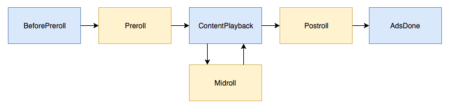

<link rel="stylesheet" href="./lib/railroad-diagrams.css"/>
<link rel="stylesheet" href="states.css"/>

# States

videojs.contrib-ads moves through various states as a content video plays. Here's a state diagram which shows the states of the ads plugin and how it transitions between them:

Ad states are yellow and content states are blue. If the current state is an ad state, the plugin is in ad mode.

Many methods in the public API are implemented by inspecting the current state. The current state instance should not be inspected directly by ad plugins.

States are implemented as classes with a 3-tiered inheritance hierarchy. All states extend either `AdState` or `ContentState`. In turn, `AdState` and `ContentState` extend `State`.

## BeforePreroll (extends ContentState)

The initial state. On source change, contrib-ads returns to this state for the new source. This state is not an ad state because content playback has not been requested yet, therefor playback has not been blocked by the ad plugin yet.

## Preroll (extends AdState)

We move into this state when content playback is requested, as indicated by the `play` event. At this point, playback is officially blocked by the ad plugin. Ads may or may not play during this time. For example, we we learn that there are no preroll ads and move on. We leave this state when content playback begins, resulting in a `playing` event.

## ContentPlayback (extends ContentState)

This state represents normal content playback, even if the player is paused.

## Midroll (extends AdState)

This state encapsulates preparing for midroll ads, playing midroll ads, and restoring content after midroll ads. It begins when the ad plugin invokes `startLinearAdMode` and it ends when content resumes, resulting in a `playing` event.

## Postroll (extends AdState)

This state begins when content ends for the first time, resulting in a `readyforpostroll` event. A preroll may play during this state. This state leads to the AdsDone state; the ad plugin will not return to ContentPlayback for this source.

## AdsDone (extends ContentState)

No more ads will play. The user can seek and re-watch content as they please. The only way to leave this state is by changing the content source.

